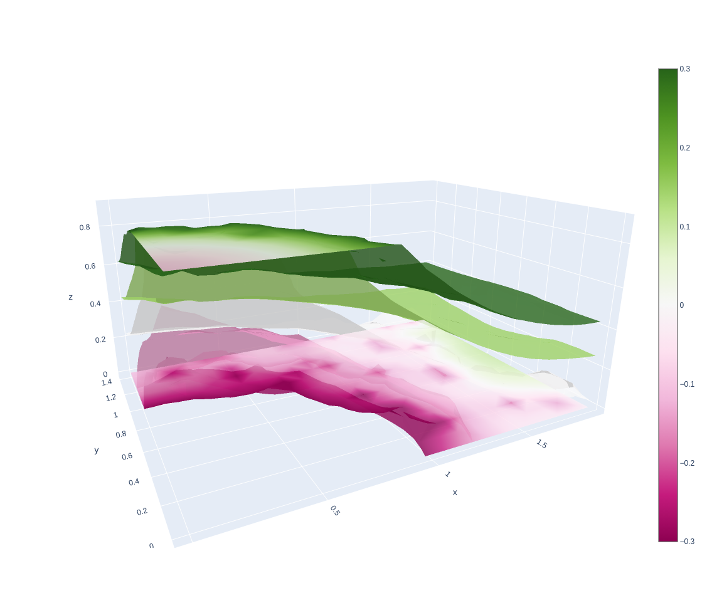

# volumetric-diffusion

C OpenMP multithreaded volumetric diffusion of signed scalar fields as a Python module.

## Install

    git clone https://github.com/Rheinwalt/volumetric-diffusion.git
    cd volumetric-diffusion
    python setup.py install

## Usage

```python
import numpy as np

# plotting in 3D
import plotly.graph_objects as go
from mpl_toolkits.mplot3d import Axes3D
from matplotlib import pyplot as pl

# volumetric diffusion
from vdiffusion import diffuse

# matplotlib 3D helper function
def show(x, y, z, v):
    s = ~np.isnan(v)
    fg = pl.figure(1, (8, 6))
    ax = fg.add_subplot(111, projection = '3d')
    im = ax.scatter(x[s], y[s], z[s], c = v[s], vmin = -1, vmax = 1, cmap = pl.cm.PiYG)
    cb = fg.colorbar(im, ax = ax)
    cb.set_label('Signed distance field')
    ax.set_xlabel('UTM X [m]')
    ax.set_ylabel('UTM Y [m]')
    ax.set_zlabel('Elevation [m]')
    pl.tight_layout()
    pl.show()

# example data
x, y = np.meshgrid(np.arange(0, 2.0, 0.1),
                   np.arange(0, 1.5, 0.1))
z = 0.8 * np.exp(-x*x-y*y) + 0.1
v = np.zeros((10, x.shape[0], x.shape[1]))
for i in range(10):
    v[i] = i/10 - z

# missing data
v[np.random.random(v.shape) > 0.8] = np.nan
v[:, np.random.random(x.shape) > 0.2] = np.nan

# voxel coordinates
y, z, x = np.meshgrid(np.arange(0, 1.5, 0.1),
                      np.arange(0, 1.0, 0.1),
                      np.arange(0, 2.0, 0.1))

# show initial data
show(x, y, z, v)

# diffuse individual iterations
for i in range(1, 3):
    vi = diffuse(v, iterations = i)
    show(x, y, z, vi)

# diffuse until steady state
vi = diffuse(v)
show(x, y, z, vi)

# visualizing isosurfaces with plotly
s = ~np.isnan(vi)
fig = go.Figure(data = go.Isosurface(
    x = x[s], y = y[s], z = z[s],
    value = vi[s],
    isomin = -0.3,
    isomax = +0.3,
    opacity = 0.8,
    surface_count = 5,
    colorbar_nticks = 7,
    caps = dict(x_show = False, y_show = False)
))
fig.show()
```



